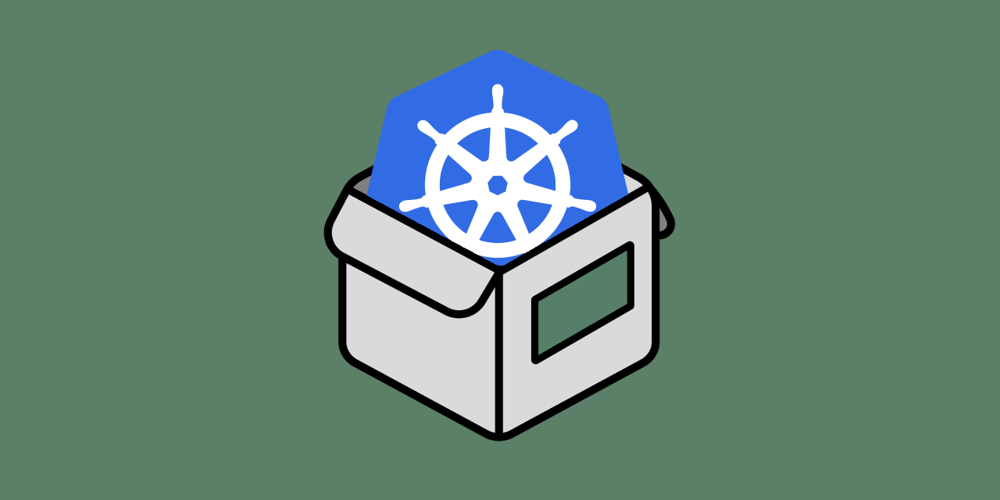

<!-- markdownlint-disable MD033 MD024 -->

[](https://github.com/ByTheHugo/homebox-helm/tags)
[](https://github.com/ByTheHugo/homebox-helm/blob/master/LICENSE)
[](https://github.com/ByTheHugo/homebox-helm/commits/master/)
[](https://github.com/ByTheHugo/homebox-helm/commits/master/)
[](https://github.com/ByTheHugo/homebox-helm)
[](https://artifacthub.io/packages/helm/homebox/homebox)



# HomeBox Helm Chart

This project provides a _Helm_ chart for deploying **[HomeBox: the inventory and organization system built for the Home User](https://github.com/sysadminsmedia/homebox)** into any _Kubernetes_ cluster. It integrates the official _Docker_ images built by the _HomeBox_ team and hosted on _[DockerHub](https://hub.docker.com/r/sysadminsmedia/homebox)_. It also includes _[PostgreSQL](https://artifacthub.io/packages/helm/bitnami/postgresql)_ server that use the **Bitnami** charts, but it is easy to provide your own.

The charts are built and then published to these project _GitHub Pages_, allowing anyone to quickly deploy and test the application.

<!-- omit in toc -->
## Table of content

- [HomeBox Helm Chart](#homebox-helm-chart)
  - [1.1. Prerequisite](#11-prerequisite)
  - [1.2. Configure the application](#12-configure-the-application)
    - [1.2.1. Use an external PostgreSQL server](#121-use-an-external-postgresql-server)
  - [1.3. Install the application](#13-install-the-application)
    - [1.3.1. Add the GitHub Helm repository (optional)](#131-add-the-github-helm-repository-optional)
    - [1.3.2. Install the chart](#132-install-the-chart)
      - [1.3.2.1. Install a specific version of HomeBox](#1321-install-a-specific-version-of-homebox)
    - [1.3.3. Verify the deployment](#133-verify-the-deployment)
  - [1.4. Uninstall the application](#14-uninstall-the-application)
  - [1.5. License](#15-license)
  - [1.6. Contact](#16-contact)

## 1.1. Prerequisite

- A **Kubernetes** cluster,
- A **PostgreSQL** server (optional),
- The **Helm** client installed locally (see _[Quickstart Guide](https://helm.sh/docs/intro/quickstart/)_),
- The `kubectl` command-line tool installed locally (optionnal, see _[Install Tools](https://kubernetes.io/docs/tasks/tools/)_)

<p align="right"><a href="#homebox-helm-chart">back to top</a></p>

## 1.2. Configure the application

Like any other _Helm_ chart, the available configuration options can be found in the `chart/values.yaml` configuration file. I recommend you to override any values in a dedicated `homebox.values.yaml` file before deploying the chart:

1. Start by retrieving the chart default values: `helm show values chart > homebox.values.yaml`

2. Edit the `homebox.values.yaml` values, and specially the following ones:

    ```yaml
    env:
      HBOX_DATABASE_DRIVER: postgres

    # For more information checkout: https://artifacthub.io/packages/helm/bitnami/postgresql
    postgresql:
      enabled: true
      auth:
        username: homebox-user
        password: homebox-password
        database: homebox-db

    ingress:
      enabled: true
      hosts:
        - host: homebox.domain.tld
          paths:
            - path: /
              pathType: ImplementationSpecific
    ```

### 1.2.1. Use an external PostgreSQL server

By default, the chart deploys a _PostgreSQL_ server via a subchart dependency. However, if want to use your own instance, you can set the following values:

```yaml
postgresql:
  enabled: false
externalPostgresql:
  host: postgres.domain.tld
  port: 5432
  auth:
    username: external-homebox-user
    password: external-homebox-password
    database: external-homebox-db
```

<p align="right"><a href="#homebox-helm-chart">back to top</a></p>

## 1.3. Install the application

To deploy the application using Helm, follow these steps:

### 1.3.1. Add the GitHub Helm repository (optional)

```bash
helm repo add homebox https://bythehugo.github.io/homebox-helm/
helm repo update
```

### 1.3.2. Install the chart

```bash
helm upgrade --install homebox homebox/homebox -f homebox.values.yaml
```

You can also install the chart directly from sources:

```bash
helm upgrade --install homebox chart -f homebox.values.yaml
```

#### 1.3.2.1. Install a specific version of HomeBox

If you want to install a specific version of _HomeBox_, you must define the `.image.tag` key in the `values.yaml` file or directly inline:

```bash
helm upgrade --install --set "image.tag=0.19.0" homebox homebox/homebox
```

### 1.3.3. Verify the deployment

```bash
kubectl get all -l app=homebox
```

Replace <namespace> with your target namespace if you specified one.

<p align="right"><a href="#homebox-helm-chart">back to top</a></p>

## 1.4. Uninstall the application

To uninstall the _Helm_ chart and remove all associated resources from your _Kubernetes_ cluster, follow these steps:

1. Identify the release name you used when installing the chart. If you haven't changed the release name, it may be the default or the one you specified during installation.

2. Run the following command to uninstall the release:

    ```bash
    helm uninstall homebox
    ```

3. Verify that the resources have been removed:

    ```bash
    kubectl get all -l app=homebox
    ```

    This should return no resources related to the uninstalled release.

**Note:** If you used custom namespaces during installation, include the `-n <namespace>` flag in the commands:

```bash
helm uninstall homebox -n <namespace>
kubectl get all -n <namespace> -l app=homebox
```

<p align="right"><a href="#homebox-helm-chart">back to top</a></p>

## 1.5. License

Distributed under the Apache 2.0 License. See `LICENSE` for more information.

<p align="right"><a href="#homebox-helm-chart">back to top</a></p>

## 1.6. Contact

Hugo CHUPIN - <hugo@chupin.xyz> - [hugo.chupin.xyz](https://hugo.chupin.xyz) - [@hugo.chupin.xyz](https://bsky.app/profile/hugo.chupin.xyz)

Project link: [https://github.com/ByTheHugo/homebox-helm](https://github.com/ByTheHugo/homebox-helm)

<p align="right"><a href="#homebox-helm-chart">back to top</a></p>
